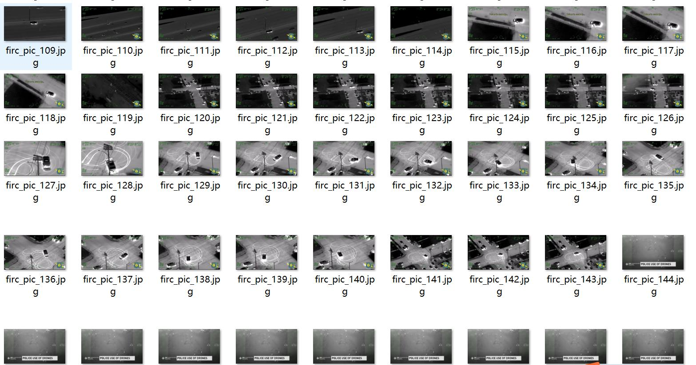
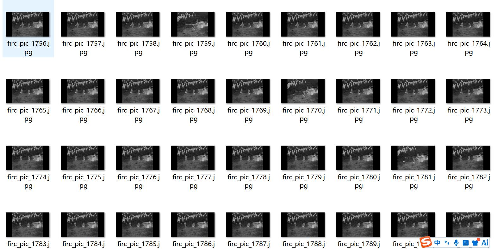
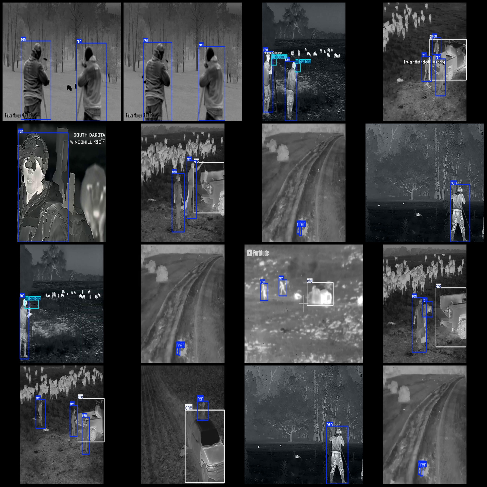
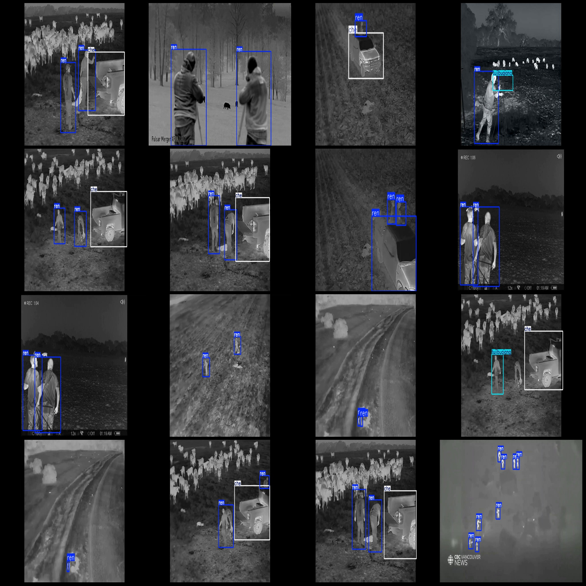

# Illegal hunting scene thermal imaging night vision image detection dataset in Pascal VOC+YOLO format, 2326 images with 3 categories

Dataset format: Pascal VOC format + YOLO format (without split path in txt files, only containing jpg images and corresponding VOC format xml files and yolo format txt files)
Number of images (jpg file count): 2362
Number of annotations (xml file count): 2362
Number of annotations (txt file count): 2362
Number of annotation categories: 3
Annotation category names (notice the order of yolo format categories does not correspond to this, but refer to the labels folder classes.txt for accuracy): ["che", "ren", "tujibuqiang"]
Number of bounding boxes per category:
che (car) = 1600
ren (person) = 4749
tujibuqiang (assault rifle) = 380
Total bounding boxes = 6729
Number of images per category:
che (car) = 874
ren (person) = 2267
tujibuqiang (assault rifle) = 332
Image resolution: 1280x720
Annotation tool used: labelImg
Annotation rules: draw a rectangle around the category
Important note: The dataset does not include any split into training, validation, or test sets; you need to do that yourself.
Special notice: This dataset does not guarantee the accuracy of the models or weight files trained on it.
Image preview:
Annotation example:

## Images

Here is a pay link on Stripe ( https://buy.stripe.com/3cs8yP7sY87d0vu9AB ). Please contact me lonlonago@foxmail.com after funding $89, and I will send you a complete data files , thank you!

